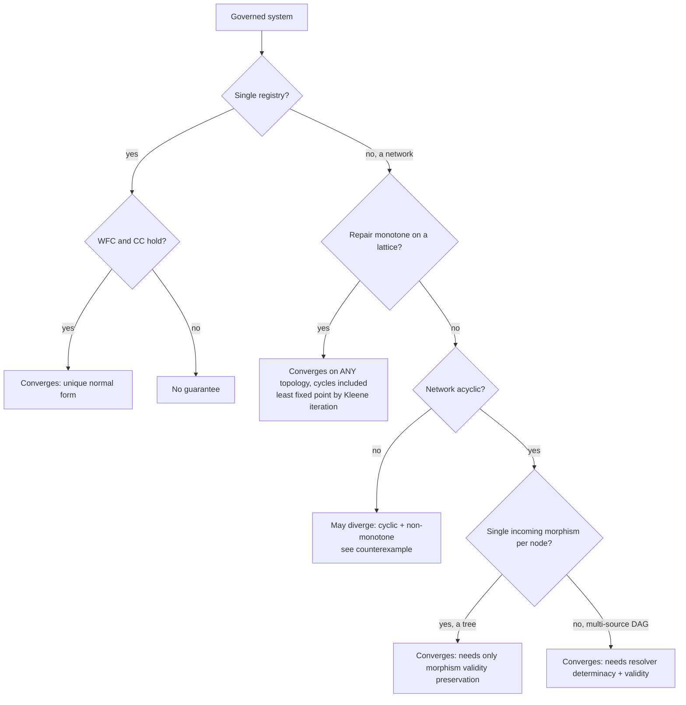

# When does a governed network converge? A field guide to the regimes

The papers prove convergence under several different conditions, tuned to the shape of your
network and the nature of your repair. This page is the practitioner's map: find your situation,
read off whether it converges and why. It is a companion to the papers, not a replacement; each
row points at the theorem that proves it.

## The one-sentence idea

A set of operations converges (every processor that sees the same events reaches the same valid
state, regardless of order) when disagreement is *prevented*. There are three ways to prevent
it, from most to least restrictive:

```
  operation commutativity      invariant confluence          normalization confluence
  (CRDTs)                       (I-confluence)                (this work)
  operations commute            all orderings preserve         operations may VIOLATE
  for all states                invariants; no repair          invariants; COMPENSATION
                                 ever needed                    repairs, and repaired
                                                                results converge
  strongest requirement  ----------------------------------->  weakest requirement
```

Normalization confluence is the widest of the three: it *allows* operations that individually
break invariants, and asks only that (a) compensation always terminates (WFC) and (b) the
*repaired* results are order-independent (CC). CRDTs are the special case where no repair is ever
needed.

## Single registry

| You have | You need | Converges? | Proof |
|---|---|---|---|
| One registry | **WFC** (repair terminates) + **CC** (repaired results are order-independent) | **Yes**, unique normal form | Convergence Theorem (`cor:unique-nf`) |

WFC = every compensation chain is finite. CC = two independent events, each followed by repair,
commute (CC1), and repairing before vs after an event gives the same result (CC2). This is the
core theorem; everything below reduces to it. Mechanized in `coq/Governance.v` (axiom-free).

## Networks of registries (federation)

Registries are connected by **morphisms** (directed constraints: a source fixes part of a
target). Whether the network converges depends on its **topology** and on whether repair is
**monotone**.

| Topology | Repair | You need | Converges? | Proof |
|---|---|---|---|---|
| **Tree** (each registry has at most one incoming morphism) | any (may be non-monotone) | morphism **validity preservation** (M1); everything else is *derived* from acyclicity | **Yes** | `thm:fed-convergence` |
| **Acyclic, multi-source** (a target merges several sources via a resolver) | any | resolver **source determinacy** (R1) + **validity preservation** (R2) | **Yes** | `thm:resolved-convergence` |
| **Any topology, including cycles** | **monotone** on an ordered (lattice) shared domain | monotone + validity-preserving morphisms/resolvers | **Yes**, to the least fixed point | `thm:monotone-cycles` |
| **Cyclic** | **non-monotone** | (no condition suffices) | **No** (may diverge) | counterexample `prop:cycle-necessary` |
| **Sub-federation** (convex, internally convergent) | any | convexity | collapses to a single **effective registry**; outer network converges iff the collapsed one does | `thm:collapse` |

The monotone-cycles row is the deepest result: when the shared domain is a lattice and repair is
monotone, the federated repair operator has a **least fixed point** reached by Kleene iteration
from the bottom element, and every order reaches the same one (Knaster-Tarski + chaotic
iteration). Its constructive finite-lattice core is mechanized in `coq/Federation.v` (axiom-free).

## The decision, as a flowchart



## Why the boundaries are where they are

- **Why acyclicity for non-monotone repair.** A cycle lets two registries constrain each other
  in opposite directions. The counterexample (`prop:cycle-necessary`) uses the negation morphism
  `phi(x) = 1 - x`: repair keeps flipping the shared value, so compensation never settles. Break
  the cycle (a tree or DAG) and repair has a definite direction to flow.
- **Why monotonicity escapes it.** If repair only ever moves the shared value **up** a lattice
  order (monotone), even a cycle cannot flip it back and forth: the values climb a chain that
  must stop at the least fixed point. Acyclicity was never the real requirement; taming
  non-monotone repair was. Monotone repair and acyclic structure are two independent routes to
  the same convergence.
- **Why CRDTs are the easy corner.** A join-semilattice whose merge is its join is monotone and
  never needs to repair an invariant, so a state-based CRDT is exactly the monotone-cycles case
  with compensation switched off. Normalization confluence adds business invariants on top.

## Where each regime lives in the code and proofs

| Regime | gsm API | Mechanized |
|---|---|---|
| Single registry | `Registry.Build` (verifies WFC + CC) | `coq/Governance.v`, `coq/Gsm.v` |
| Tree / DAG federation | `Federation` with directed morphisms; `Resolver` for multi-source | (paper) |
| Monotone cycles | `Federation.AllowMonotoneCycles()` | `coq/Federation.v` (least-fixed-point core) |
| Compositional collapse | `Federation.Embed` | (paper) |

See the papers for the full statements and proofs, and `coq/README.md` for what is machine-checked.
