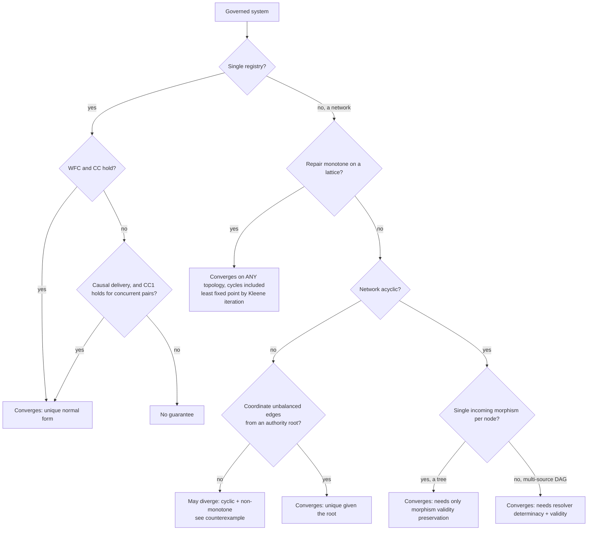

# When does a governed network converge? A field guide to the regimes

The papers prove convergence under several different conditions, tuned to the shape of your
network and the nature of your repair. This page is the practitioner's map: find your situation,
read off whether it converges and why. It is a companion to the papers, not a replacement; each
row points at the theorem that proves it.

## The one-sentence idea

A set of operations converges (every processor that sees the same events reaches the same valid
state, regardless of order) when disagreement is *prevented*. There are three ways to prevent
it, from most to least restrictive:

```
  operation commutativity      invariant confluence          normalization confluence
  (CRDTs)                       (I-confluence)                (this work)
  operations commute            all orderings preserve         operations may VIOLATE
  for all states                invariants; no repair          invariants; COMPENSATION
                                 ever needed                    repairs, and repaired
                                                                results converge
  strongest requirement  ----------------------------------->  weakest requirement
```

Normalization confluence is the widest of the three: it *allows* operations that individually
break invariants, and asks only that (a) compensation always terminates (WFC) and (b) the
*repaired* results are order-independent (CC). CRDTs are the special case where no repair is ever
needed.

## Single registry

| You have | You need | Converges? | Proof |
|---|---|---|---|
| One registry | **WFC** (repair terminates) + **CC** (repaired results are order-independent) | **Yes**, unique normal form | Convergence Theorem (`cor:unique-nf`) |
| One registry, **causal delivery** (an event is applied only after the events it depends on) | **WFC** + **CC2** + **CC1 only for concurrent pairs** (distinct events enabled together); causally ordered pairs need not commute | **Yes**, unique normal form | `causal_governance_confluent`, `causal_convergence` |
| One registry, **at-least-once delivery** (duplicates) | the conditions above + every duplicated event's governed step idempotent (and, under causal delivery, causally consistent redelivery) | **Yes**, same state as exactly-once | `alo_commuting_converges`, `causal_alo_converges` |
| One registry, a duplicated **non-idempotent** event | | **No** (diverges) | `non_idempotent_diverges`, `late_duplicate_diverges` |

WFC = every compensation chain is finite. CC = two independent events, each followed by repair,
commute (CC1), and repairing before vs after an event gives the same result (CC2). This is the
core theorem; everything below reduces to it. Mechanized in `coq/Governance.v` (axiom-free), and
in `coq/GovernanceWF.v` with the WFC potential in any well-founded order (ordinals, lexicographic
products), not only the natural numbers, so the state space need not be finite.

**Exact, not only sufficient.** `coq/GovernanceConverse.v` proves the converses. With canonical
repair (`rho_star` returns a valid state) and free delivery, every configuration from `s0` has a
unique normal form **iff** CC holds on the states reachable from `s0` (`cc_exact_from`). For any
enabledness (causal, guarded) the exact condition is JC: the critical pairs are joinable at every
reachable configuration (`jc_exact`); CC is the case where the join is an equality. Under causal
delivery the exact condition is CCR: concurrent pairs commute after every causally consistent prefix
(`causal_exact`). The naive converses are false (`rho_star_qualifier`, `masked_cc1`,
`naive_causal_converse_fails`).

**Exact versus checked.** JC, CCR and the reachable form of CC quantify over reachable states, so
checking them means exploring the reachable state space. CC checked at every state (and CC1 on the
declared-independent pairs) implies them and is what gsm's `Build` checks: sufficient, cheap to
enumerate, and necessary only at reachable states.

**Causal variant.** The base theorem asks CC1 of every pair of events, so every replay order must
agree. Real replicated systems usually promise only causal delivery, under which two causally
ordered events are never enabled at the same time and only *concurrent* events can arrive in
either order. CC1 is then needed only for those concurrent pairs. `coq/GovernanceCausal.v` proves
the full rewrite-system Convergence Theorem under that weaker hypothesis
(`causal_governance_confluent`; the witness `cw_confluent` / `cw_violates_all_pairs_cc1` meets it
while violating all-pairs CC1). `coq/CausalReplay.v` proves the replay form for governed steps
(apply, then normalize): if they commute on every concurrent pair, any two causally consistent
delivery orders reach the same state (`causal_convergence`). This is also how gsm's declared
`Independent` pairs read: `causal_tequiv` shows any two causally consistent orders are
trace-equivalent under concurrency, and `Trace.v`'s `run_tequiv` shows trace-equivalent sequences
reach the same state. So when the declared-independent pairs cover the concurrent ones, gsm's check
of only those pairs is the causal-delivery form of CC1. All axiom-free.

## Networks of registries (federation)

Registries are connected by **morphisms** (directed constraints: a source fixes part of a
target). Whether the network converges depends on its **topology** and on whether repair is
**monotone**.

| Topology | Repair | You need | Converges? | Proof |
|---|---|---|---|---|
| **Tree** (each registry has at most one incoming morphism) | any (may be non-monotone) | morphism **validity preservation** (M1); everything else is *derived* from acyclicity | **Yes** | `thm:fed-convergence` |
| **Acyclic, multi-source** (a target merges several sources via a resolver) | any | resolver **source determinacy** (R1) + **validity preservation** (R2) | **Yes** | `thm:resolved-convergence` |
| **Any topology, including cycles** | **monotone** on an ordered (lattice) shared domain | monotone + validity-preserving morphisms/resolvers | **Yes**, to the least fixed point | `thm:monotone-cycles` |
| **Cyclic** | **non-monotone**, coordination-free | (no condition suffices) | **No** (may diverge) | counterexample `prop:cycle-necessary` |
| **Cyclic**, invertible transports | **non-monotone**, with a computed coordination | values driven along a spanning tree from an **authority root**; balanced non-tree edges kept as checked constraints; unbalanced edges coordinated | **Yes**, unique **given the root** | `coordinated_sound`, `coordinated_unique_nf` (`CoordinatedCycles.v`) |
| **Sub-federation** (convex, internally convergent) | any | convexity | collapses to a single **effective registry**; outer network converges iff the collapsed one does | `thm:collapse` |

The monotone-cycles row is the deepest result: when the shared domain is a lattice and repair is
monotone, the federated repair operator has a **least fixed point** reached by Kleene iteration
from the bottom element, and every order reaches the same one (Knaster-Tarski + chaotic
iteration). Its constructive finite-lattice core is mechanized in `coq/Federation.v` (axiom-free),
and `coq/ChaoticACC.v` extends it to lattices with no infinite ascending chain (ACC).

**Events across registries.** The rows above are about the normalizer. Local events on different
registries interleaving with propagation are a separate question:

- *Acyclic.* Per-registry conditions plus C1 (cross-registry CC) and C2 (repaired CC) give
  convergence of every interleaving (`fed_interleavings_converge`, `coq/FederationEvents.v`). C1 and
  C2 at witnesses realized by reachable states are also necessary (`fed_exact`, `fed_exact_full`,
  `coq/FederationEventsConverse.v`); static C1 and C2, which gsm checks, are sufficient but not
  necessary (`naive_converse_fails`).
- *Monotone cycles.* Interleavings converge **iff** the global condition GC holds: independent
  governed steps commute at every reachable federated state (`gc_iff`,
  `coq/FederationEventsCycles.v`). GC has no per-edge reduction on a cycle, so checking it means
  exploring the federated state space.

**Non-monotone cycles under coordination.** A non-monotone cycle has no coordination-free normal
form. With the holonomy-minimal plan (an authority root, a spanning tree that drives values, balanced
non-tree edges as checks, unbalanced edges coordinated), it has one, unique given the root
(`coordinated_sound`); keeping an unbalanced edge leaves no consistent state
(`coordination_needed`). The root matters (`root_choice_matters`), and without one two orders reach
different consistent states (`copyback_without_authority`).

## The decision, as a flowchart


```mermaid
flowchart TD
  A[Governed system] --> B{Single registry?}
  B -- yes --> C{WFC and CC hold?}
  C -- yes --> C1[Converges: unique normal form]
  C -- no --> C0{Causal delivery, and CC1 holds for concurrent pairs?}
  C0 -- yes --> C1
  C0 -- no --> C2[No guarantee]
  B -- no, a network --> D{Repair monotone on a lattice?}
  D -- yes --> D1[Converges on ANY topology, cycles included<br/>least fixed point by Kleene iteration]
  D -- no --> E{Network acyclic?}
  E -- no --> E0{Coordinate unbalanced edges<br/>from an authority root?}
  E0 -- no --> E1[May diverge: cyclic + non-monotone<br/>see counterexample]
  E0 -- yes --> E2[Converges: unique given the root]
  E -- yes --> F{Single incoming morphism per node?}
  F -- yes, a tree --> F1[Converges: needs only morphism validity preservation]
  F -- no, multi-source DAG --> F2[Converges: needs resolver determinacy + validity]
```

## Why the boundaries are where they are

- **Why acyclicity for non-monotone repair.** A cycle lets two registries constrain each other
  in opposite directions. The counterexample (`prop:cycle-necessary`) uses the negation morphism
  `phi(x) = 1 - x`: repair keeps flipping the shared value, so compensation never settles. Break
  the cycle (a tree or DAG) and repair has a definite direction to flow.
- **Why monotonicity escapes it.** If repair only ever moves the shared value **up** a lattice
  order (monotone), even a cycle cannot flip it back and forth: the values climb a chain that
  must stop at the least fixed point. Acyclicity was never the real requirement; taming
  non-monotone repair was. Monotone repair and acyclic structure are two independent routes to
  the same convergence.
- **Why CRDTs are the easy corner.** A join-semilattice whose merge is its join is monotone and
  never needs to repair an invariant, so a state-based CRDT is exactly the monotone-cycles case
  with compensation switched off. The op-based side is sharper still: under causal delivery, the
  compensation-free fragment (normalization is the identity) is *exactly* the op-based CRDTs, in
  both directions (`compensation_free_exact`), and standard op-based CRDTs converge as an instance
  (`causal_cmrdt_SEC`). Normalization confluence adds business invariants on top, and that is
  strictly more: `witness_causal_not_cmrdt` converges causally without being a CRDT, and
  `witness_beyond_all_pairs` (an add, a causally later remove, an independent counter) converges
  although its operations do not all commute.

## Where each regime lives in the code and proofs

| Regime | gsm API | Mechanized |
|---|---|---|
| Single registry | `Registry.Build` (verifies WFC + CC) | `coq/Governance.v`, `coq/Gsm.v` |
| Single registry, causal delivery | declared `Independent` pairs (CC1 checked only on those) | `coq/GovernanceCausal.v`, `coq/CausalReplay.v`, `coq/Trace.v` (`run_tequiv`, bridged by `causal_tequiv`) |
| Single registry, exact condition | (`Build` checks the sufficient form) | `coq/GovernanceConverse.v` |
| At-least-once delivery | non-idempotent events reported (`Report.NotIdempotent`) | `coq/AtLeastOnce.v` |
| Tree / DAG federation | `Federation` with directed morphisms; `Resolver` for multi-source | `coq/FederationOrder.v`, `coq/Categorical.v` (order-independence, retraction); the authority and resolution theorems as stated are paper-level |
| Events across registries (acyclic) | cross-registry order check (C1, C2) | `coq/FederationEvents.v`, `coq/FederationEventsConverse.v` |
| Monotone cycles | `Federation.AllowMonotoneCycles()` | `coq/Federation.v` (least-fixed-point core), `coq/Chaotic.v`, `coq/ChaoticACC.v`, `coq/FederationEventsCycles.v` |
| Non-monotone cycles, coordinated | `CoordinationPlan` (cuts every cycle) | `coq/CoordinatedCycles.v` (soundness of the holonomy-minimal plan in gsm's `HOLONOMY-COORDINATION-DESIGN.md`) |
| Compositional collapse | `Federation.Embed` | (paper) |

See the papers for the full statements and proofs, and `coq/README.md` for what is machine-checked.

## Two verified oracles re-certify the single-registry verdict

The single-registry row is not only proven in the abstract; a built gsm machine's convergence is
re-certified by two independent checkers extracted from the axiom-free Coq development, so a bug in
gsm's hand-written Go verification cannot pass a non-convergent machine.

| Oracle | Certifies | Source | Trusts gsm's tables? |
|---|---|---|---|
| **Table oracle** (`checker`) | the emitted step tables commute and stay in range | `coq/Checker.v` | yes (checks what gsm emitted) |
| **Rules oracle** (`astchecker`) | the rules themselves converge, by re-evaluating the combinator AST | `coq/AstChecker.v`, `coq/AstTables.v`, `coq/AstCompact.v` | no (recomputes from declarations) |

Both are extracted OCaml binaries (`coq/extraction/`); gsm's differential tests run them on real
machines. The rules oracle is the stronger check: it re-derives convergence straight from the
declared invariants and events, trusting neither gsm's enumeration nor its normalization.
