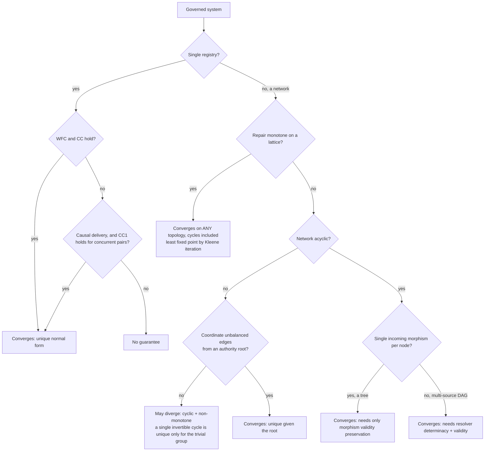

# When does a governed network converge? A field guide to the regimes

The papers prove convergence under several different conditions, tuned to the shape of your
network and the nature of your repair. This page is the practitioner's map: find your situation,
read off whether it converges and why. It is a companion to the papers, not a replacement; each
row points at the theorem that proves it.

## The one-sentence idea

A set of operations converges (every processor that sees the same events reaches the same valid
state, regardless of order) when disagreement is *prevented*. There are three ways to prevent
it, from most to least restrictive:

```
  operation commutativity      invariant confluence          normalization confluence
  (CRDTs)                       (I-confluence)                (this work)
  operations commute            all orderings preserve         operations may VIOLATE
  for all states                invariants; no repair          invariants; COMPENSATION
                                 ever needed                    repairs, and repaired
                                                                results converge
  strongest requirement  ----------------------------------->  weakest requirement
```

Normalization confluence is the widest of the three: it *allows* operations that individually
break invariants, and asks only that (a) compensation always terminates (WFC) and (b) the
*repaired* results are order-independent (CC). CRDTs are the special case where no repair is ever
needed.

## Single registry

| You have | You need | Converges? | Proof |
|---|---|---|---|
| One registry | **WFC** (repair terminates) + **CC** (repaired results are order-independent) | **Yes**, unique normal form | Convergence Theorem (`cor:unique-nf`) |
| One registry, **causal delivery** (an event is applied only after the events it depends on) | **WFC** + **CC2** + **CC1 only for concurrent pairs** (distinct events enabled together); causally ordered pairs need not commute | **Yes**, unique normal form | `causal_governance_confluent`, `causal_convergence` |
| One registry, **at-least-once delivery** (duplicates) | exactly-once commutation at reachable states + each event idempotent at every reachable state where it is first delivered (under causal delivery: CCR + the same per event, with causally consistent redelivery) | **Yes, if and only if**, same state as exactly-once | `alo_exact`, `causal_alo_exact_idem`; sufficient forms `alo_commuting_converges`, `causal_alo_converges` |
| One registry, a duplicated **non-idempotent** event | | **No** (diverges) when the failure is at a reachable state; an event needs deduplication iff its duplicate is not absorbed (`safe_free_exact`) | `non_idempotent_diverges`, `notidem_needs_dedup`, `late_duplicate_diverges` |
| One registry, **guarded enabledness that a compensation step can disable** (a buffered event stops being enabled after repair) | termination from the start + **JC'**: JC's event/event clause, and for each event enabled at an invalid state, repairing after it joins with repairing first; JC alone is neither sufficient nor necessary here | **Yes, if and only if**; normal forms may leave disabled events in the buffer | `jcg_exact`, `jcsplit_exact`, `gnf_iff`; `dc_jc_insufficient`, `nv_jc_not_necessary` (`EnabledAfterComp.v`) |
| **State-based CRDT** merges (payload states as events, merge as the action, no repair) | merges commute and are idempotent at every state reachable from the start; equivalently, on the reachable states a join-semilattice for which each merge is the join with its payload | **Yes, if and only if**, under every order and any duplication | `merge_action_exact`, `merge_conv_alo_exact`, `cvrdt_on_exact`; `naive_cvrdt_iff_fails`, `clamp_reach_qualifier` (`CvRDTExact.v`) |
| **Stream processors** (incremental, time-indexed received sets) | under `Progress`: PJC at every duplicate-free event set (free delivery: PCC) | **Yes, if and only if**: settled processors with the same received set agree | `stream_exact`, `stream_exact_free` |

WFC = every compensation chain is finite. CC = two independent events, each followed by repair,
commute (CC1), and repairing before vs after an event gives the same result (CC2). This is the
core theorem; everything below reduces to it. Mechanized in `coq/Governance.v` (axiom-free), and
in `coq/GovernanceWF.v` with the WFC potential in any well-founded order (ordinals, lexicographic
products), not only the natural numbers, so the state space need not be finite.

**Exact, not only sufficient.** `coq/GovernanceConverse.v` proves the converses. With canonical
repair (`rho_star` returns a valid state) and free delivery, every configuration from `s0` has a
unique normal form **iff** CC holds on the states reachable from `s0` (`cc_exact_from`). For
causal or guarded enabledness that persists under compensation, the exact condition is JC: the
critical pairs are joinable at every reachable configuration (`jc_exact`); CC is the case where the
join is an equality. When a compensation step can disable a buffered event, `coq/EnabledAfterComp.v`
gives the exact condition JC' (`jcg_exact`), which is JC when enabledness persists
(`jcsplit_iff_jc`); JC alone is then neither sufficient (`dc_jc_insufficient`) nor necessary
(`nv_jc_not_necessary`). Under causal
delivery the exact condition is CCR: concurrent pairs commute after every causally consistent prefix
(`causal_exact`). The naive converses are false (`rho_star_qualifier`, `masked_cc1`,
`naive_causal_converse_fails`). `coq/GovernanceWFConverse.v` states the same converses over any
well-founded potential (`wf_jc_exact`, `wf_cc_exact_from`, `canonical_cc_exact_from`) and shows that
termination itself is exact: the system terminates iff compensation is well-founded iff some
well-founded potential exists (`terminating_iff_comp_wf`, `comp_wf_iff_wfc`). At-least-once delivery
(`coq/AtLeastOnceExact.v`: `alo_exact`, `causal_alo_exact`) and stream processors
(`coq/StreamExact.v`: `stream_exact`) have exact conditions too; for streams the natural iff with JC
is false (`jc_not_necessary`).

**Exact versus checked.** JC, CCR and the reachable form of CC quantify over reachable states, so
checking them means exploring the reachable state space. CC checked at every state (and CC1 on the
declared-independent pairs) implies them and is what gsm's `Build` checks: sufficient, cheap to
enumerate, and necessary only at reachable states.

**Causal variant.** The base theorem asks CC1 of every pair of events, so every replay order must
agree. Real replicated systems usually promise only causal delivery, under which two causally
ordered events are never enabled at the same time and only *concurrent* events can arrive in
either order. CC1 is then needed only for those concurrent pairs. `coq/GovernanceCausal.v` proves
the full rewrite-system Convergence Theorem under that weaker hypothesis
(`causal_governance_confluent`; the witness `cw_confluent` / `cw_violates_all_pairs_cc1` meets it
while violating all-pairs CC1). `coq/CausalReplay.v` proves the replay form for governed steps
(apply, then normalize): if they commute on every concurrent pair, any two causally consistent
delivery orders reach the same state (`causal_convergence`). This is also how gsm's declared
`Independent` pairs read: `causal_tequiv` shows any two causally consistent orders are
trace-equivalent under concurrency, and `Trace.v`'s `run_tequiv` shows trace-equivalent sequences
reach the same state. So when the declared-independent pairs cover the concurrent ones, gsm's check
of only those pairs is the causal-delivery form of CC1. All axiom-free.

## Networks of registries (federation)

Registries are connected by **morphisms** (directed constraints: a source fixes part of a
target). Whether the network converges depends on its **topology** and on whether repair is
**monotone**.

| Topology | Repair | You need | Converges? | Proof |
|---|---|---|---|---|
| **Tree** (each registry has at most one incoming morphism) | any (may be non-monotone) | morphism **validity preservation** (M1); everything else is *derived* from acyclicity | **Yes**, unique repair normal form; every event order converges **iff** C1 and C2 hold at reachable witnesses (guarded model) | `frun_solves`, `solve_unique`, `order_independent`; `fed_exact`, `fed_thm_fed_convergence_exact` |
| **Acyclic, multi-source** (a target merges several sources via a resolver) | any | resolver **source determinacy** (R1) + **validity preservation** (R2) | **Yes**, unique repair normal form; event order as for trees | `fed_lem_resolved_termination`; `fed_thm_resolved_convergence_exact` |
| **Any topology, including cycles** | **monotone** on an ordered (lattice) shared domain with ACC (finite lattices qualify) | monotone morphisms/resolvers; the least fixed point is valid **iff** some Kleene iterate is valid (sufficient: valid at bottom, or gsm's image-validity check) | **Yes**, to the least fixed point; every event order converges **iff** GC (per-target C1 and C2 over images suffice) | `cyc_N_lfp`, `chaotic_reaches_lfp`, `lfp_valid_iff_reached`, `gsm_check_Ncyc_valid`; `gc_iff`, `cyc_check_gc_lfp` |
| **Single cycle**, invertible transports, coherently oriented | **non-monotone**, coordination-free, no authority root | a consistent state exists **iff** the holonomy is trivial | Unique **iff** the group is trivial; otherwise there is no unique normal form (two orders reach different consistent states, or none exists) | `rootless_nf_exists_iff`, `rootless_unique_normal_form_iff` (`RootlessCycles.v`) |
| **Cyclic**, any other network without a root | **non-monotone**, coordination-free | no exact condition yet (open; see `REGIME-AUDIT.md`) | **May diverge** | counterexample `prop_cycle_necessary`; a consistent state can still exist (`c13_two_ways_not_exhaustive`) |
| **Cyclic**, invertible transports | **non-monotone**, with a computed coordination | values driven along a spanning tree from an **authority root**; balanced non-tree edges kept as checked constraints; unbalanced edges coordinated | **Yes**, unique **given the root**; event order converges **iff** independent root events commute at the reachable root values | `coordinated_sound`, `coordinated_unique_nf` (`CoordinatedCycles.v`); `coordinated_events_exact` (`CoordinatedExact.v`) |
| **Any graph**, non-invertible (lossy) transports | coordination from a **root set** (every registry reachable from some root) | some root assignment drives a state satisfying every edge | A consistent state exists **iff** that holds (deciding it is NP-complete in general: the 3-SAT reduction is mechanized, NP-completeness by the standard argument); unique given the root values | `root_set_criterion_graph`, `root_set_count`, `root_set_bijection` (`RootSet.v`); `net_section_iff_sat`, `net_size`, `np_certificate` (`LossyHardness.v`) |
| **Any graph**, non-invertible transports, **event order** under root-set coordination | values driven along an outward spanning forest from the root set | for each root, its independent events commute at every value reachable from its start value by its own events | **Yes, if and only if**: one condition per root, roots never interact | `forest_events_exact`, `forest_perm_exact`, `forest_events_exact_global` (`RootSetEvents.v`) |
| **Sub-federation** (convex), acyclic | any | C1 and C2 at reachable witnesses inside the block; convexity | collapses to a single **effective registry**; outer network converges **iff** the collapsed one does | `collapse_a_guarded_exact`, `collapse_c_exact` (`Collapse.v`); cyclic monotone blocks are paper only |

The monotone-cycles row is the deepest result: when the shared domain is a lattice and repair is
monotone, the federated repair operator has a **least fixed point** reached by Kleene iteration
from the bottom element, and every order reaches the same one (Knaster-Tarski + chaotic
iteration). Its constructive finite-lattice core is mechanized in `coq/Federation.v` (axiom-free),
and `coq/ChaoticACC.v` extends it to lattices with no infinite ascending chain (ACC).
`coq/MonotoneExact.v` makes the rest exact: the least fixed point is reached at a finite stage iff
the Kleene chain is eventually constant (`kleene_reach_exact`), and it is valid iff some Kleene
iterate is valid (`lfp_valid_iff_reached`). gsm's image-validity check is proved sound
(`gsm_check_Ncyc_valid`) but is not necessary (`gsm_check_not_necessary`). On a complete lattice
without ACC, existence of the least fixed point is classical Knaster-Tarski, outside the axiom-free
gate; this is a design exclusion, and gsm's finite domains satisfy ACC.

**Events across registries.** The rows above are about the normalizer. Local events on different
registries interleaving with propagation are a separate question:

- *Acyclic.* Per-registry conditions plus C1 (cross-registry CC) and C2 (repaired CC) give
  convergence of every interleaving (`fed_interleavings_converge`, `coq/FederationEvents.v`). C1 and
  C2 at witnesses realized by reachable states are also necessary (`fed_exact`, `fed_exact_full`,
  `coq/FederationEventsConverse.v`); static C1 and C2, which gsm checks, are sufficient but not
  necessary (`naive_converse_fails`). With propagation as separate steps (the distributed model),
  XU plus each registry's own CC is sufficient (`dist_interleavings_converge`); no exact condition
  is mechanized for that model, and it is not modeled on cycles.
- *Monotone cycles.* Interleavings converge **iff** the global condition GC holds: independent
  governed steps commute at every reachable federated state (`gc_iff`,
  `coq/FederationEventsCycles.v`). GC has no per-edge reduction on a cycle; gsm's per-target C1 and
  C2 over image sets imply it (`cyc_check_gc_lfp`, `coq/FederationEventsCyclesCheck.v`).
- *Coordinated non-monotone cycles.* Event order converges **iff** independent events at the
  authority root commute at every root value reachable from the start (`coordinated_events_exact`,
  `coq/CoordinatedExact.v`).
- *Root-set coordination on lossy networks.* The same, one root at a time: event order converges
  **iff** each root's independent events commute at every value that root's own events reach
  (`forest_events_exact`, `coq/RootSetEvents.v`). Events on different roots commute
  (`forest_cross_commute`), and events on driven registries are overwritten
  (`forest_driven_noop`).

**Non-monotone cycles under coordination.** A non-monotone cycle has no coordination-free unique
normal form in general: on a single coherently oriented invertible cycle without a root, a unique
one exists from every start iff the group is trivial (`rootless_unique_normal_form_iff`), although a
consistent state exists whenever the holonomy is trivial (`rootless_nf_exists_iff`). With the
holonomy-minimal plan (an authority root, a spanning tree that drives values, balanced
non-tree edges as checks, unbalanced edges coordinated), it has one, unique given the root
(`coordinated_sound`); keeping an unbalanced edge leaves no consistent state
(`coordination_needed`). The root matters (`root_choice_matters`), and without one two orders reach
different consistent states (`copyback_without_authority`, `rootless_two_orders`). For
non-invertible (lossy) transports the authority root generalizes to a root set: a consistent state
exists iff some assignment of root values drives a state satisfying every edge
(`root_set_criterion_graph`, `coq/RootSet.v`), and sections correspond one to one with consistent
root assignments (`root_set_count`). Deciding existence is NP-complete in general: the 3-SAT
reduction of the research note of PR #52 is mechanized (`net_section_iff_sat`, parsimonious by
`net_count`, linear by `net_size`, with the certificate `np_certificate`; `coq/LossyHardness.v`), and
NP-completeness follows by the standard argument, so no efficient exact criterion exists unless
P = NP. Event order under root-set coordination is exact (`forest_events_exact`,
`coq/RootSetEvents.v`).

## The decision, as a flowchart


```mermaid
flowchart TD
  A[Governed system] --> B{Single registry?}
  B -- yes --> C{WFC and CC hold?}
  C -- yes --> C1[Converges: unique normal form]
  C -- no --> C0{Causal delivery, and CC1 holds for concurrent pairs?}
  C0 -- yes --> C1
  C0 -- no --> C2[No guarantee]
  B -- no, a network --> D{Repair monotone on a lattice?}
  D -- yes --> D1[Converges on ANY topology, cycles included<br/>least fixed point by Kleene iteration]
  D -- no --> E{Network acyclic?}
  E -- no --> E0{Coordinate unbalanced edges<br/>from an authority root?}
  E0 -- no --> E1[May diverge: cyclic + non-monotone<br/>a single invertible cycle is unique only for the trivial group]
  E0 -- yes --> E2[Converges: unique given the root]
  E -- yes --> F{Single incoming morphism per node?}
  F -- yes, a tree --> F1[Converges: needs only morphism validity preservation]
  F -- no, multi-source DAG --> F2[Converges: needs resolver determinacy + validity]
```

## Why the boundaries are where they are

- **Why acyclicity for non-monotone repair.** A cycle lets two registries constrain each other
  in opposite directions. The counterexample (`prop:cycle-necessary`) uses the negation morphism
  `phi(x) = 1 - x`: repair keeps flipping the shared value, so compensation never settles. Break
  the cycle (a tree or DAG) and repair has a definite direction to flow.
- **Why monotonicity escapes it.** If repair only ever moves the shared value **up** a lattice
  order (monotone), even a cycle cannot flip it back and forth: the values climb a chain that
  must stop at the least fixed point. Acyclicity was never the real requirement; taming
  non-monotone repair was. Monotone repair and acyclic structure are two independent routes to
  the same convergence.
- **Why CRDTs are the easy corner.** A join-semilattice whose merge is its join is monotone and
  never needs to repair an invariant, so a state-based CRDT is exactly the monotone-cycles case
  with compensation switched off. The op-based side is sharper still: under causal delivery, the
  compensation-free fragment (normalization is the identity) is *exactly* the op-based CRDTs, in
  both directions (`compensation_free_exact`), and standard op-based CRDTs converge as an instance
  (`causal_cmrdt_SEC`). Normalization confluence adds business invariants on top, and that is
  strictly more: `witness_causal_not_cmrdt` converges causally without being a CRDT, and
  `witness_beyond_all_pairs` (an add, a causally later remove, an independent counter) converges
  although its operations do not all commute.

## Where each regime lives in the code and proofs

| Regime | gsm API | Mechanized |
|---|---|---|
| Single registry | `Registry.Build` (verifies WFC + CC) | `coq/Governance.v`, `coq/Gsm.v` |
| Single registry, causal delivery | declared `Independent` pairs (CC1 checked only on those) | `coq/GovernanceCausal.v`, `coq/CausalReplay.v`, `coq/Trace.v` (`run_tequiv`, bridged by `causal_tequiv`) |
| Single registry, exact condition | (`Build` checks the sufficient form) | `coq/GovernanceConverse.v`, `coq/GovernanceWFConverse.v` (any well-founded potential), `coq/EnabledAfterComp.v` (enabledness a compensation step can disable) |
| State-based CRDTs | n/a | `coq/CRDT.v`, `coq/CvRDTExact.v` (exact condition) |
| At-least-once delivery | non-idempotent events reported (`Report.NotIdempotent`: sound at reachable witnesses, complete when exactly-once delivery converges, may over-report at unreachable states) | `coq/AtLeastOnce.v`, `coq/AtLeastOnceExact.v` |
| Stream processors | n/a | `coq/Stream.v`, `coq/StreamExact.v` |
| Tree / DAG federation | `Federation` with directed morphisms; `Resolver` for multi-source | `coq/FederationOrder.v`, `coq/Categorical.v`, `coq/CategoricalBridge.v` (order-independence, retraction); `coq/FederationGRS.v` (the authority and resolution theorems in corrected form) |
| Events across registries (acyclic) | cross-registry order check (C1, C2) | `coq/FederationEvents.v`, `coq/FederationEventsConverse.v` |
| Monotone cycles | `Federation.AllowMonotoneCycles()` | `coq/Federation.v` (least-fixed-point core), `coq/Chaotic.v`, `coq/ChaoticACC.v`, `coq/MonotoneFederation.v`, `coq/MonotoneExact.v` (validity, reachability, gsm's check), `coq/FederationEventsCycles.v`, `coq/FederationEventsCyclesCheck.v`, `coq/FederationEventsCyclesMulti.v` |
| Non-monotone cycles, coordinated | `CoordinationPlan` (cuts every cycle) | `coq/CoordinatedCycles.v` (soundness of the holonomy-minimal plan in gsm's `HOLONOMY-COORDINATION-DESIGN.md`), `coq/CoordinatedExact.v` (event order) |
| Non-monotone cycles, no root | (rejected by `Build`) | `coq/RootlessCycles.v` (single invertible cycles) |
| Non-invertible transports | `Federation.DiagnoseCycle` | `coq/CohomologyGeneral.v` (single cycle, rooted), `coq/RootSet.v` (root sets), `coq/LossyHardness.v` (the 3-SAT reduction), `coq/RootSetEvents.v` (event order) |
| Compositional collapse | `Federation.Embed` | `coq/Collapse.v` (acyclic blocks); cyclic monotone blocks are paper only |

Regime by regime status, including the gaps still open, is in [REGIME-AUDIT.md](REGIME-AUDIT.md).

See the papers for the full statements and proofs, and `coq/README.md` for what is machine-checked.

## Two verified oracles re-certify the single-registry result

The single-registry row is not only proven in the abstract; a built gsm machine's convergence is
re-certified by two independent checkers extracted from the axiom-free Coq development, so a bug in
gsm's hand-written Go verification cannot pass a non-convergent machine.

| Oracle | Certifies | Source | Trusts gsm's tables? |
|---|---|---|---|
| **Table oracle** (`checker`) | the emitted step tables commute and stay in range | `coq/Checker.v` | yes (checks what gsm emitted) |
| **Rules oracle** (`astchecker`) | the rules themselves converge, by re-evaluating the combinator AST | `coq/AstChecker.v`, `coq/AstTables.v`, `coq/AstCompact.v` | no (recomputes from declarations) |

Both are extracted OCaml binaries (`coq/extraction/`); gsm's differential tests run them on real
machines. The rules oracle is the stronger check: it re-derives convergence straight from the
declared invariants and events, trusting neither gsm's enumeration nor its normalization.
